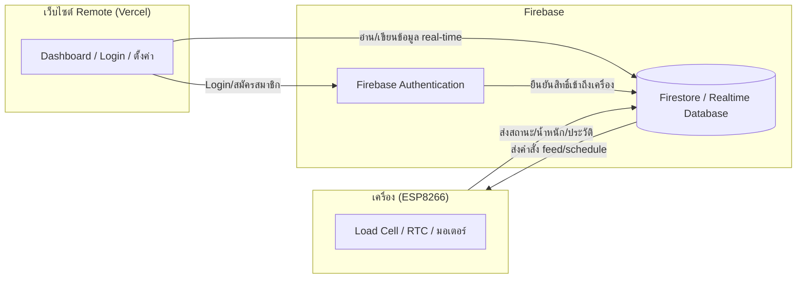

# 🏗️ ARCHITECTURE.md — สถาปัตยกรรมระบบ

## เทคโนโลยีที่ใช้

| ส่วน | เทคโนโลยี | หน้าที่ |
|---|---|---|
| เว็บไซต์ Remote (Frontend) | **Vercel** | โฮสต์เว็บ Login, Dashboard, จัดการเครื่อง, ประวัติ |
| ฐานข้อมูล + Backend | **Firebase Database** (Firestore หรือ Realtime Database) | เก็บข้อมูลเครื่อง ตารางเวลา ประวัติการให้อาหาร สถานะแบบ Real-time |
| ระบบสมาชิก | **Firebase Authentication** | Login / สมัครสมาชิก / ลืมรหัสผ่าน |
| สิทธิ์การเข้าถึง | **Firebase Security Rules** | จำกัดให้แต่ละบัญชีเห็น/คุมได้เฉพาะเครื่องของตัวเอง |
| ตัวเครื่อง | **ESP8266** | เชื่อมต่อ Firebase โดยตรงผ่าน HTTPS (ไลบรารี Firebase ESP8266 Client) |
| เว็บไซต์ Local | เสิร์ฟจาก ESP8266 เอง | ตั้งค่า WiFi + Dashboard ควบคุมใกล้เครื่อง ไม่พึ่ง Vercel/Firebase |

---

## Data Flow



- เครื่องเขียนสถานะ/น้ำหนัก/ประวัติเข้า Firebase โดยตรง เว็บ Remote อ่านค่าแบบ Real-time ทันทีที่ข้อมูลเปลี่ยน (ไม่ต้องรอ sync)
- คำสั่งจากเว็บ (เช่น "ให้อาหารตอนนี้") ถูกเขียนลง Firebase แล้วเครื่อง Poll/Subscribe อ่านคำสั่งมาปฏิบัติ
- หากอินเทอร์เน็ตหลุด เครื่องยังทำงานตามตารางที่ตั้งไว้ได้ด้วย RTC DS3231 แล้วค่อยซิงค์ข้อมูลย้อนหลังเข้า Firebase เมื่อกลับมาออนไลน์

---

## โครงสร้างข้อมูลใน Firebase (ตัวอย่าง)

```
users/
  {userId}/
    email
    devices: [deviceId1, deviceId2, ...]

devices/
  {deviceId}/
    name
    ownerId
    status: online / offline
    ledStatus: red / yellow / green
    weightRemaining: 1200        // กรัม
    dailyUsage: 150              // กรัม/วัน
    wifi:
      apName
      apPassword
      homeSsid
    schedule/
      round1: { time, grams, enabled }
      round2: { time, grams, enabled }
      round3: { time, grams, enabled }
      round4: { time, grams, enabled }
    feedHistory/
      {feedId}: { date, time, grams, mode, weightBefore, weightAfter }
    commands/
      feedNow: { grams, requestedAt, status }
```

---

## บทบาทของ Vercel

โฮสต์เว็บไซต์ **Remote Mode** ทั้งหมด (Login, Dashboard, ตั้งค่าเครื่อง, ประวัติ) รองรับ Framework เช่น Next.js/React ที่เชื่อม Firebase SDK จากฝั่ง Client โดยตรง หน้า **Local Mode** (`192.168.4.1`) ไม่เกี่ยวกับ Vercel เพราะเสิร์ฟจากตัว ESP8266 เอง ต้องทำงานได้แม้ไม่มีอินเทอร์เน็ต

## บทบาทของ Firebase

1. **Authentication** — จัดการ Login/สมัครสมาชิก/ลืมรหัสผ่าน
2. **Database** — เก็บข้อมูลเครื่อง ตารางเวลา ประวัติ และสถานะแบบ Real-time
3. **Security Rules** — จำกัดสิทธิ์ให้ผู้ใช้เข้าถึงได้เฉพาะเครื่องของตัวเอง (แทนการตรวจสอบ Device ID/Password แบบ manual)
4. **Cloud Functions (ทางเลือก)** — ใช้คำนวณแจ้งเตือนอาหารใกล้หมด หรือส่ง Push Notification

## การเชื่อมต่อฝั่งเครื่อง (ESP8266 ↔ Firebase)

- ใช้ไลบรารี Firebase ESP8266 Client เชื่อมต่อ Database ผ่าน HTTPS โดยตรง ไม่ต้องมี MQTT Broker กลาง
- เครื่อง Subscribe/Poll ที่ `devices/{deviceId}/commands` เพื่อรอรับคำสั่งจากเว็บ
- เครื่องเขียนสถานะ/น้ำหนัก/ประวัติกลับไปที่ `devices/{deviceId}/...` ให้เว็บอ่านแบบ Real-time
- ควรออกแบบ Security Rules ให้รัดกุมก่อนใช้งานจริง เพื่อป้องกันผู้ใช้เข้าถึงเครื่องของผู้อื่น
