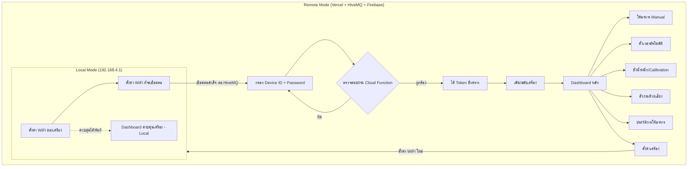

# 🌐 PAGES.md — หน้าเว็บทั้งหมดในระบบ

## ภาพรวมหน้าเว็บทั้งหมด

| # | ชื่อหน้า | โหมด | โฮสต์/เข้าถึงผ่าน |
|---|---|---|---|
| 1 | ตั้งค่า WiFi ของเครื่อง | Local | ESP8266 เสิร์ฟเอง ที่ `192.168.4.1` |
| 2 | ตั้งค่า WiFi ที่จะเชื่อมต่อ | Local | ESP8266 เสิร์ฟเอง ที่ `192.168.4.1` |
| 3 | Dashboard ควบคุมเครื่อง (Local) | Local | ESP8266 เสิร์ฟเอง ที่ `192.168.4.1` |
| 4 | กรอก Device ID + Password | Remote | เว็บไซต์บน Vercel + Firebase Cloud Function |
| 5 | เพิ่ม/สลับเครื่อง | Remote | หลังกรอก Device ID สำเร็จอย่างน้อย 1 เครื่อง |
| 6 | Dashboard หลัก | Remote | หลังยืนยัน Device ID + Password |
| 7 | ให้อาหาร Manual | Remote/Local | จาก Dashboard |
| 8 | ตั้งเวลาให้อาหารอัตโนมัติ | Remote/Local | จาก Dashboard |
| 9 | ระบบชั่งน้ำหนัก / Calibration | Remote/Local | จาก Dashboard |
| 10 | สั่งงานด้วยเสียง | Remote | จาก Dashboard (ต้องใช้ HTTPS ของ Vercel) |
| 11 | ประวัติการให้อาหาร | Remote/Local | จาก Dashboard ข้อมูลจาก Firebase |
| 12 | ตั้งค่าเครื่อง | Remote/Local | จาก Dashboard |

**หมายเหตุ:** ไม่มีระบบ Login/สมัครสมาชิก และไม่มีหน้ารายการบัญชีผู้ใช้ เพราะสิทธิ์ผูกกับ Device ID + Password โดยตรง

---

## กลุ่ม Local Mode (ไม่ต้องใช้อินเทอร์เน็ต)

**1. ตั้งค่า WiFi ของเครื่อง (Device AP Setup)** — เชื่อมต่อ WiFi ของเครื่องแล้วเปิด `http://192.168.4.1` เพื่อตั้ง/แก้ไขชื่อและรหัสผ่านของ WiFi ที่เครื่องปล่อยออกมาเอง

**2. ตั้งค่า WiFi ที่จะให้เครื่องเชื่อมต่อ (Home WiFi Setup)** — สแกนหา WiFi บ้าน เลือก SSID กรอกรหัสผ่าน แล้วสั่งให้เครื่องเชื่อมต่อ เมื่อสำเร็จเครื่องจะสลับเข้าสู่ Remote Mode และเริ่มเชื่อมต่อ HiveMQ อัตโนมัติ

**3. Dashboard ควบคุมเครื่อง (Local)** — ควบคุมเครื่องได้ทันทีผ่าน `192.168.4.1` โดยไม่ต้องกรอก Device ID/Password ซ้ำ (เพราะอยู่ในวงเครือข่ายเดียวกับเครื่องอยู่แล้ว) ทำได้ทั้งให้อาหาร Manual ตั้งเวลาอัตโนมัติ ดูน้ำหนักคงเหลือ Tare/Calibration และดูประวัติที่บันทึกไว้ในเครื่อง

---

## กลุ่มเข้าถึงเครื่อง (Remote Mode)

**4. กรอก Device ID + Password** — หน้าแรกที่เจอเมื่อเข้าเว็บ Remote กรอก Device ID และ Password ของเครื่องที่ต้องการคุม เว็บส่งไปตรวจสอบผ่าน Firebase Cloud Function ถ้าถูกต้องจะได้ Token ชั่วคราวสำหรับคุมเครื่องนั้น และเว็บจะจำ Device ID ไว้ใน localStorage ให้อัตโนมัติในครั้งถัดไป

**5. เพิ่ม/สลับเครื่อง** — ถ้าเคยกรอก Device ID ไว้หลายเครื่องในเบราว์เซอร์เดียวกัน หน้านี้ให้สลับไปคุมเครื่องอื่นได้ หรือกรอก Device ID + Password ใหม่เพื่อเพิ่มเครื่องเข้ารายการ (รายการนี้อยู่แค่ในเบราว์เซอร์นั้น ไม่ sync ข้ามอุปกรณ์)

---

## กลุ่มควบคุมและตรวจสอบเครื่อง (Remote Mode)

**6. Dashboard หลัก** — ศูนย์กลางแสดงสถานะเครื่อง น้ำหนักอาหารคงเหลือ และเชื่อมไปยังฟังก์ชันย่อยทั้งหมด

**7. ให้อาหาร Manual** — กำหนดปริมาณ (กรัม) แล้วสั่งให้อาหารทันที คำสั่งถูก Publish ผ่าน HiveMQ ไปเครื่องแทบจะทันที พร้อมดูน้ำหนักแบบ Real-time

**8. ตั้งเวลาให้อาหารอัตโนมัติ** — ตั้งตารางเวลาสูงสุด 4 รอบ/วัน กำหนดเวลา ปริมาณ และเปิด/ปิดแต่ละรอบ บันทึกลง Firebase และแจ้งเครื่องผ่าน HiveMQ

**9. ระบบชั่งน้ำหนัก / Calibration** — ทำ Tare และ Calibration ของ Load Cell พร้อมตั้งค่าปริมาณอาหารที่ใช้ต่อวันสำหรับคำนวณวันคงเหลือ

**10. สั่งงานด้วยเสียง** — เปิดไมโครโฟน แปลงเสียงเป็นคำสั่งด้วย Web Speech API ให้ตรวจสอบก่อนส่ง (ต้องใช้งานผ่าน HTTPS ซึ่ง Vercel รองรับโดยอัตโนมัติ)

**11. ประวัติการให้อาหาร** — แสดงตารางประวัติ (วันที่ เวลา ปริมาณ โหมด น้ำหนักก่อน-หลัง) ดึงข้อมูลจาก Firebase แบบ Real-time กรองตามช่วงวันที่ได้

---

## กลุ่มตั้งค่า (Remote Mode)

**12. ตั้งค่าเครื่อง** — ตั้งชื่อเครื่อง เปลี่ยน Password ของเครื่อง แก้ไข WiFi ของเครื่อง (AP) และ WiFi ที่เชื่อมต่อ (Home WiFi) จากระยะไกล รวมถึงปุ่ม "ลืมเครื่องนี้" (ลบออกจากรายการในเบราว์เซอร์ ไม่ใช่ลบเครื่องจริง)

---

## แผนผังความสัมพันธ์ของหน้าเว็บ

หน้ากลุ่ม Remote ทุกหน้า (ยกเว้นหน้ากรอก Device ID + Password) ต้องผ่านการตรวจสอบสำเร็จก่อนจึงเข้าถึงได้ ส่วนหน้า Local Mode ทั้งหมดทำงานได้โดยไม่ต้องมีอินเทอร์เน็ตและไม่ต้องกรอก Password ซ้ำเพราะเข้าผ่าน WiFi ของเครื่องโดยตรง
