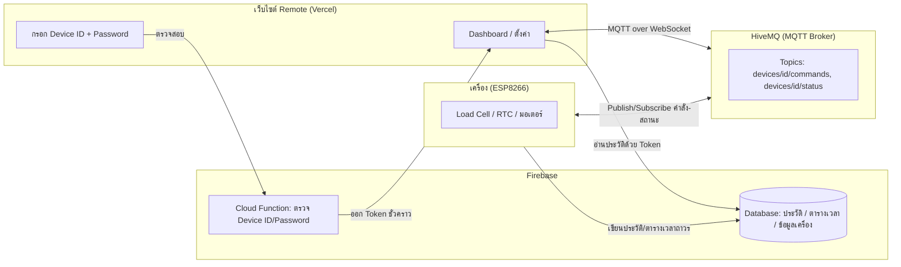

# 🏗️ ARCHITECTURE.md — สถาปัตยกรรมระบบ

## แนวคิดหลักของระบบ

ระบบนี้มีสองโหมดการเชื่อมต่อหลักที่ต้องแยกให้ชัดเจน:

- AP Mode: ตัวเครื่องปล่อย Wi-Fi ของตัวเองเอง ใช้สำหรับตั้งค่าและควบคุมเครื่องทันทีโดยไม่ต้องพึ่งอินเทอร์เน็ต
- Online Mode: ตัวเครื่องเชื่อมต่อ Wi-Fi จากแหล่งอื่น เช่น Wi-Fi บ้านหรือสถานที่ที่มีอินเทอร์เน็ต แล้วใช้ร่วมกับ MQTT/Firebase เพื่อควบคุมจากระยะไกล

ทั้งสองโหมดใช้หน้าเว็บเดียวกันและมีฟังก์ชันควบคุมที่เหมือนกันทั้งหมด เพื่อให้ผู้ใช้ไม่ต้องเรียนรู้หน้าจอใหม่เมื่อสลับโหมด

---

## เทคโนโลยีที่ใช้

| ส่วน | เทคโนโลยี | หน้าที่ |
|---|---|---|
| เว็บไซต์ Remote (Frontend) | **Vercel** | โฮสต์เว็บ Dashboard, กรอก Device ID/Password, ตั้งค่า, ประวัติ |
| MQTT Broker (Cloud, Real-time) | **HiveMQ** — 1 Cluster ใช้ร่วมกันทั้งระบบ | รับ-ส่งคำสั่งและสถานะระหว่างเว็บกับเครื่องแบบเรียลไทม์ |
| ฐานข้อมูล + เก็บข้อมูลถาวร | **Firebase Database** — 1 Project ใช้ร่วมกันทั้งระบบ | เก็บข้อมูลเครื่อง ตารางเวลา ประวัติการให้อาหาร |
| ตรวจสอบสิทธิ์เข้าเครื่อง | **Firebase Cloud Function** | เช็ค Device ID + Password แล้วออก Token ชั่วคราวผูกกับเครื่องนั้น |
| สิทธิ์การเข้าถึงข้อมูล | **Firebase Security Rules** | อนุญาตอ่าน/เขียนเฉพาะ deviceId ที่ตรงกับ Token |
| ตัวเครื่อง | **ESP8266** | ทำหน้าที่เป็นทั้ง AP Mode และ Online Mode, เชื่อมต่อ HiveMQ และเขียนข้อมูลถาวรเข้า Firebase |
| เว็บไซต์ Local | เสิร์ฟจาก ESP8266 เอง | ตั้งค่า WiFi + Dashboard ควบคุมใกล้เครื่อง ไม่พึ่ง HiveMQ/Firebase/Vercel |

**ไม่มีระบบ Login/สมัครสมาชิก** — ไม่มี `users/` collection ในระบบ สิทธิ์การเข้าถึงผูกกับ **Device ID + Password** โดยตรง ไม่ใช่บัญชีผู้ใช้

**หลักการแบ่งหน้าที่:** HiveMQ ใช้สำหรับ "สั่งงานตอนนี้เดี๋ยวนี้" (คำสั่งให้อาหาร, สถานะออนไลน์, น้ำหนักปัจจุบัน) ส่วน Firebase ใช้เก็บ "ข้อมูลที่ต้องอยู่ถาวร" (ประวัติการให้อาหาร ตารางเวลา ข้อมูลเครื่อง) และเป็นตัวตรวจสอบ Device ID/Password ผ่าน Cloud Function

---

## โหมดการทำงานที่แยกชัดเจน

### 1. AP Mode
- ตัวเครื่องปล่อย Wi-Fi ของตัวเอง เช่น `Feeder-Setup`
- ผู้ใช้เชื่อมต่อกับ Wi-Fi ของเครื่องโดยตรงผ่าน `192.168.4.1`
- ใช้สำหรับตั้งค่าเครื่องและควบคุมเครื่องแบบ Local ได้ทันที
- ไม่ต้องอาศัยอินเทอร์เน็ตหรือ MQTT/Firebase
- ควรมี QR Code สำหรับเชื่อมต่อ Wi-Fi ของเครื่องโดยไม่ต้องกรอกรหัสด้วยมือ

### 2. Online Mode
- ตัวเครื่องเชื่อมต่อ Wi-Fi จากที่อื่น เช่น Wi-Fi บ้านหรือ Wi-Fi ที่มีอินเทอร์เน็ต
- ใช้สำหรับควบคุมจากระยะไกลผ่าน MQTT/HiveMQ และ Firebase
- ทำงานเหมือนกับ AP Mode ในแง่ของฟังก์ชันควบคุมหน้าเว็บ
- หน้าเว็บเดียวกันสามารถใช้ได้ทั้งสองโหมด

### 3. ข้อสรุปสำคัญ
- AP Mode ใช้ Wi-Fi จากตัวเครื่องเอง
- Online Mode ใช้ Wi-Fi จากแหล่งภายนอก
- ฟังก์ชันการควบคุมและหน้าเว็บเป็นแบบเดียวกัน ไม่จำเป็นต้องแยกหน้า UI

---

## QR Code สำหรับ AP Mode

ควรเพิ่ม QR Code ใน AP Mode เพื่อให้ผู้ใช้สแกนแล้วเข้าถึงหน้าตั้งค่าและการเชื่อมต่อได้ทันที โดยข้อมูลใน QR Code ควรมี:

- SSID ของ AP ของเครื่อง
- Password ของ AP ของเครื่อง
- URL สำหรับเปิดหน้า AP Mode เช่น `http://192.168.4.1`

เมื่อสแกน QR Code แล้ว ผู้ใช้จะได้ทั้งการเชื่อมต่อ Wi-Fi ของเครื่องและเข้าเว็บไซต์ AP Mode โดยตรง ไม่ต้องพิมพ์รหัสซ้ำหรือกรอก URL ด้วยมือ

---

## Data Flow



**ลำดับการทำงานคร่าว ๆ**
1. ผู้ใช้กรอก Device ID + Password บนเว็บ → เว็บส่งไปเช็คที่ **Cloud Function**
2. Cloud Function เทียบกับ password hash ที่เก็บใน `devices/{deviceId}/passwordHash` ถ้าถูกต้อง ออก **Custom Token** ที่ฝัง `deviceId` ไว้ใน claims
3. เว็บใช้ Token นี้อ่าน/เขียนข้อมูลใน Firebase เฉพาะ path ของเครื่องนั้น และเก็บ Device ID ไว้ใน localStorage ของเบราว์เซอร์
4. ผู้ใช้กดปุ่มสั่งงาน (เช่น "ให้อาหารทันที") → เว็บ **Publish** ไปที่ topic `devices/{deviceId}/commands` บน HiveMQ
5. ESP8266 **Subscribe** topic นี้อยู่แล้ว รับคำสั่งแทบจะทันที สั่งมอเตอร์ทำงาน แล้ว **Publish** สถานะกลับที่ `devices/{deviceId}/status`
6. เมื่อให้อาหารเสร็จ ESP8266 เขียนประวัติลง **Firebase Database** เพื่อเก็บถาวร
7. หากอินเทอร์เน็ตหลุด เครื่องยังทำงานตามตารางเวลาได้ด้วย RTC DS3231 แล้วซิงค์ข้อมูลเข้า Firebase เมื่อกลับมาออนไลน์

---

## โครงสร้าง MQTT Topics (HiveMQ)

```
devices/{deviceId}/commands       ← เว็บส่งคำสั่งมาที่นี่ (feedNow, setSchedule, tare, calibrate)
devices/{deviceId}/status         ← เครื่อง publish สถานะ (online/offline, LED, น้ำหนักปัจจุบัน)
devices/{deviceId}/feedResult     ← เครื่อง publish ผลลัพธ์หลังให้อาหารเสร็จ (ก่อน sync เข้า Firebase)
```

ตั้ง **Username/Password หรือ Client Certificate ต่อเครื่อง** บน HiveMQ (ไม่ใช้ credential ตัวเดียวทั้งระบบ) และจำกัดสิทธิ์ด้วย **ACL** ให้แต่ละเครื่อง publish/subscribe ได้เฉพาะ topic ของตัวเอง (`devices/{deviceId ของตัวเอง}/#`)

---

## โครงสร้างข้อมูลใน Firebase (ตัวอย่าง)

```
devices/
  {deviceId}/
    passwordHash            // เก็บ hash ไม่เก็บรหัสตรง ๆ
    name
    hivemqClientId
    weightRemaining: 1200   // กรัม
    dailyUsage: 150         // กรัม/วัน
    wifi:
      apName
      apPassword
      homeSsid
    schedule/
      round1: { time, grams, enabled }
      round2: { time, grams, enabled }
      round3: { time, grams, enabled }
      round4: { time, grams, enabled }
    feedHistory/
      {feedId}: { date, time, grams, mode, weightBefore, weightAfter }
```

ไม่มี `users/` collection เพราะไม่มีระบบบัญชีผู้ใช้ ทุกอย่างผูกอยู่กับ `deviceId` โดยตรง

---

## Security Rules แนวคิด

```
match /devices/{deviceId} {
  allow read, write: if request.auth != null
    && request.auth.token.deviceId == deviceId;
}
```

Token ที่ได้จาก Cloud Function จะฝัง `deviceId` ไว้ใน claims ทำให้ Rules เช็คได้ว่า "Token นี้มีสิทธิ์คุมเครื่องนี้เท่านั้น" ป้องกันไม่ให้ใครก็ตามที่ไม่ผ่านการตรวจสอบ Password มาอ่าน/เขียนข้อมูลเครื่องได้ตรง ๆ

---

## บทบาทของแต่ละส่วน

**Vercel** — โฮสต์เว็บไซต์ Remote Mode ทั้งหมด เว็บเชื่อมต่อ HiveMQ ผ่าน **MQTT over WebSocket** และเชื่อมต่อ Firebase SDK ฝั่ง Client ด้วย Token ที่ได้จาก Cloud Function

**HiveMQ** — ตัวกลางส่งคำสั่ง/สถานะแบบเรียลไทม์ระหว่างเว็บกับเครื่อง ใช้ Cluster เดียวรองรับทุกเครื่องทุกผู้ใช้ในระบบ แยกกันด้วย topic ต่อ deviceId

**Firebase** — Database เก็บข้อมูลถาวร, Cloud Function ตรวจสอบ Device ID/Password และออก Token, Security Rules จำกัดสิทธิ์ตาม deviceId ใน Token ใช้ Project เดียวรองรับทุกเครื่องทุกผู้ใช้เช่นกัน

**เว็บไซต์ Local (`192.168.4.1`)** — เสิร์ฟจาก ESP8266 เอง ไม่เกี่ยวกับ HiveMQ/Firebase/Vercel เพราะต้องทำงานได้แม้ไม่มีอินเทอร์เน็ต ไม่ต้องกรอก Password ซ้ำเพราะอยู่ในวงเครือข่ายเดียวกับเครื่องอยู่แล้ว; หน้านี้ใช้เป็นหน้าแรกของ AP Mode และสามารถใช้ควบคุมเครื่องได้เหมือนกับ Online Mode

---

## ข้อจำกัดที่ควรรู้ (จากการไม่มีระบบ Login)

- รายการเครื่องที่เคยกรอกไว้ **ไม่ sync ข้ามอุปกรณ์/เบราว์เซอร์** เพราะเก็บแค่ใน localStorage
- ไม่มีการแยกสิทธิ์ระดับ "ดูอย่างเดียว" กับ "คุมได้เต็ม" — ใครมี Device ID + Password ก็คุมได้เต็มสิทธิ์เท่ากันหมด
- ควรตั้ง Password ให้สุ่มและยาวพอสมควรตอนตั้งค่าเครื่องครั้งแรก เพราะเป็นเกราะป้องกันชั้นเดียวที่มี
- ควรเก็บ Password เป็น **hash** ใน Firebase เสมอ ไม่เก็บเป็นข้อความตรง ๆ
